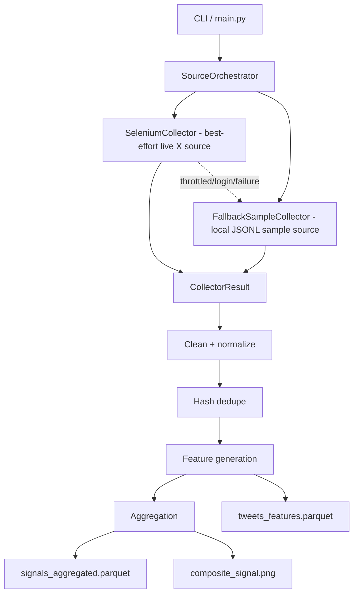

# quodeadvisors

Quantitative data engineering project for collecting, normalizing, and processing Indian market discussion data.
## Project Overview

This project implements a production-oriented market intelligence pipeline that collects, processes, and analyzes discussions related to the Indian stock market from X (Twitter). The system is designed to transform unstructured social media content into structured quantitative research signals through a modular, fault-tolerant, and scalable data engineering architecture.

The pipeline consists of:

* Data Collection - Selenium-based collector with resilient checkpointing, throttling detection, and structured logging.
* Data Processing - Text normalization, Unicode handling, deduplication, and feature extraction.
* Storage - Efficient columnar storage using Apache Parquet.
* Signal Generation - Engagement-weighted, recency-aware research signals derived from market discussions.
* Visualization & Analytics - Lightweight analytical views designed for large datasets.
* Validation Hooks - Extensible interfaces for future forward-return and predictive performance evaluation.

The system is intentionally modular so that collectors, storage backends, and signal-generation techniques can be replaced independently without affecting the remainder of the pipeline.


## Architecture



See `docs/architecture.md` for the editable architecture note and design boundary explanation.

## Scope and Assumptions

The generated signals are research signals, not trading recommendations.

The objective of this project is to demonstrate software engineering, data engineering, and system design practices under the assignment’s 24-hour delivery constraint. Where live access to X/Twitter is limited by platform throttling, the system is designed to fail gracefully, preserve collected data, and continue downstream processing using the same pipeline architecture.

The signal-generation framework is designed to support future validation against market returns but does not claim predictive performance within the scope of this assignment.

## X/Twitter Collector Architecture

The X/Twitter source is intentionally designed as a resilient data pipeline stage, not as an evasion scraper.


### Live X Collection Note

The live X collector is implemented as a best-effort source. During development,
X throttled automated browser access before any tweets could be collected.

Rather than bypassing platform controls using stealth, proxy rotation, or token manipulation,
the collector fails safely, checkpoints state, and the pipeline falls back to a local sample dataset.

This preserves the purpose of the assignment: demonstrating collection architecture,
deduplication, storage, signal generation, and scalable downstream processing.

### Source Boundary

Downstream processing code should consume `CollectorResult` objects and `Tweet` records. It should not know whether records came from Selenium, a browser profile, or local fallback sample data.

Core models:

- `Tweet`: normalized tweet payload used by all source implementations.
- `CollectorStatus`: `SUCCESS`, `PARTIAL`, `THROTTLED`, `LOGIN_REQUIRED`, `FAILED`.
- `CollectorResult`: source-neutral result envelope containing records, status, timestamps, error message, and source name.

### Collectors

- `SeleniumCollector`: best-effort X/Twitter collector using Selenium 4 and Chrome/Chromium.
- `FallbackSampleCollector`: reads normalized sample tweets from `data/input/sample_tweets.jsonl`.
- `SourceOrchestrator`: tries Selenium first and falls back to sample JSONL when Selenium returns `THROTTLED`, `LOGIN_REQUIRED`, or `FAILED`.

`SourceOrchestrator` is the boundary that turns degraded-source handling into a normal pipeline concern. Live collection can fail, throttle, or require login without forcing downstream cleaning, storage, signal generation, or visualization code to know which source produced the records.


### Future Kafka Extension

The code is structured so Kafka workers can be added later without rewriting the collector or downstream processors, but Kafka is not implemented in this assignment.

Best future extension:

- collector worker publishes `Tweet` or `CollectorResult` records to Kafka.
- processor workers consume tweets, clean/dedupe/features.
- storage worker writes Parquet.
- DLQ topic stores failed records.
- dedupe uses Redis/Postgres/DuckDB state instead of in-memory set.

### Throttling Handling

The Selenium collector detects degraded source access when:

- consecutive scrolls produce no new tweets,
- duplicate ratio is high,
- a login wall appears,
- tweet ingestion rate drops below the configured threshold.

On suspected throttling, the collector:

1. logs a structured warning,
2. writes a checkpoint,
3. returns `CollectorResult(status=CollectorStatus.THROTTLED)`,
4. does not crash the pipeline.

### Anti-Bot Boundary

The collector does not implement stealth or bypass behavior.

Explicitly excluded:

- stealth browser patches,
- proxy rotation,
- CAPTCHA bypass,
- cookie injection,
- authentication-token manipulation,
- fingerprint spoofing.

If a local Chrome profile is supplied, authentication happens naturally through that browser profile. The code does not extract credentials, inject cookies, or manipulate auth tokens.

### Why Fallback Exists

X/Twitter may return empty feeds, login walls, slow renderer responses, or throttled pages even when the browser starts correctly. A production-shaped data pipeline should preserve partial progress, make source degradation observable, and keep downstream stages testable.

The fallback sample collector allows cleaning, normalization, storage, analytics, and dashboard code to run deterministically even when live collection is unavailable.


## Run the Project

After installing dependencies, run a small end-to-end pipeline execution:

```bash
.venv/bin/python main.py --limit 100 --collection-timeout-seconds 10 --max-retries 0
```

The live X collector is attempted first. If X throttles or blocks automated browser access, the pipeline falls back to `data/input/sample_tweets.jsonl` and still exercises the same downstream cleaning, deduplication, storage, signal-generation, and visualization flow.

Expected outputs:

```text
data/output/tweets_features.parquet
data/output/signals_aggregated.parquet
data/output/composite_signal.png
```

Main verification command:

```bash
.venv/bin/python -m pytest -q
```


## Validation Run

A clean validation run was performed from a fresh virtual environment created outside the repository.

Commands verified:

```bash
python3 -m venv /tmp/quodeadvisors_fresh_venv
/tmp/quodeadvisors_fresh_venv/bin/pip install -r requirements-dev.txt
/tmp/quodeadvisors_fresh_venv/bin/python -m pytest -q
/tmp/quodeadvisors_fresh_venv/bin/ruff check .
/tmp/quodeadvisors_fresh_venv/bin/mypy .
```

Observed results:

```text
pytest: 29 passed
ruff: All checks passed
mypy: Success: no issues found in 25 source files
```

This confirms that the documented development checks work after a clean dependency installation, including third-party libraries such as Selenium, Polars, and Matplotlib.

## Development

Install dependencies:

```bash
python3 -m venv .venv
.venv/bin/pip install -r requirements-dev.txt
```

Run quality checks:

```bash
.venv/bin/python -m pytest -q
.venv/bin/ruff check .
.venv/bin/mypy .
```
