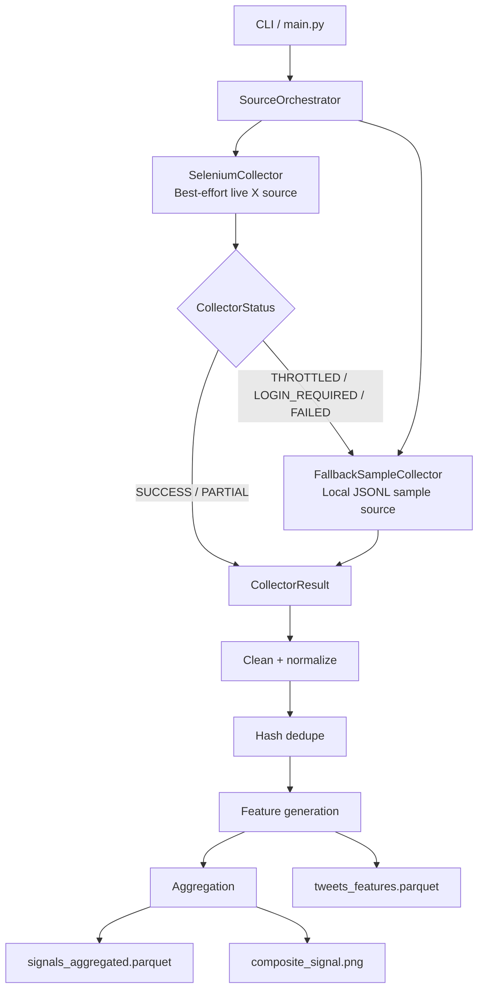

# Architecture

The system is organized as a source-neutral market intelligence pipeline. Collectors produce a common `CollectorResult`, and all downstream stages operate only on normalized records.

## Key Design Boundary

`SourceOrchestrator` is the main resilience boundary. It turns live-source failures into normal pipeline states, allowing downstream cleaning, storage, feature generation, and visualization code to remain independent of Selenium and X/Twitter behavior.
